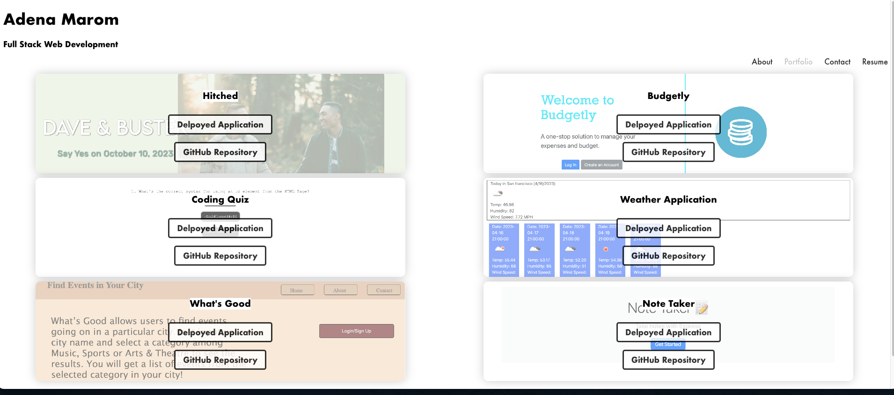

# React App Portfolio 

## Description 
A webside using react where I can display my work to potential employers and clients. There are four tabs on the navigation menu: About, Resume, Contact, and Portfolio. Under about is a short paragraph about myself. On the resume tab, you will find a list of skills and the option to download my resume. On contact, you have the option to contact me by inputting name, email, and message. The contact will return an error if the correct fields are not entered. Finally, under portfolio you will find links and repositories to 6 projects i've completed over the course of the bootcamp. On the footer you will find links to my linkedIn, GitHub, & StackOverflow. 

## Table of Contents

 [Installation](#Installation)

 [Screenshots](#Screenshots)
    
 [Questions](#Questions)

## Installation
Just visit the deployed link at https://admarom.github.io/react-portfolio/

## Screenshots

## Questions

Have questions? Email me at adenamarom@gmail.com or find me on ![GitHub] (https://github.com/AdMarom)!